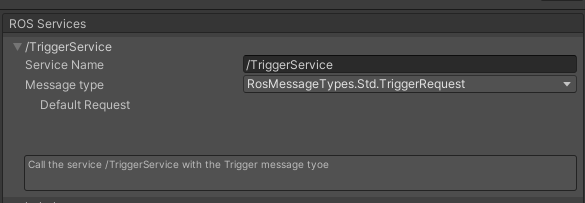
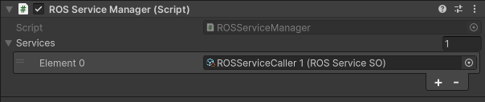
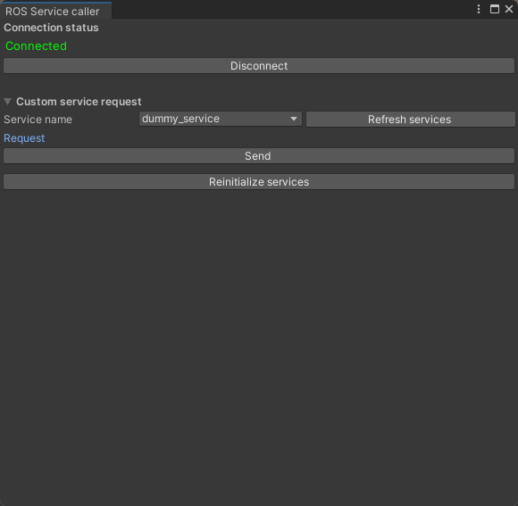

# Service management

## Registering services
Create a new ROSServiceSO (Scriptable Object) by selecting `Assets → Create → ScriptableObjects → ROS → Service Caller`.
You can add your services by inputting its name (the name needs to be the same as you would call with ROS!) and the Message type it uses. The small box allows you to type any comment regarding the service.



If your message type supports it, you can also set a default request here. Your default request will be used when you call your service with no other parameters.

If your Message type is not visible, try to refresh the types by selecting `ROS Tools → Refresh enum types`.

Once your Scriptable Object is ready, add a `ROSManager` Component to a GameObject in your scene and reference your Scriptable Object there. Note that only one `ROSManager` may exist in a scene at one time.



## Using the GUI to call a service
You can open the Service Caller window by clicking on `ROS Tools → Service Caller`.

You can use the GUI to connect to ROS while outside of play mode. This may however creates issues when you switch between the Play and Stop modes in the editor, so please use this feature carefully.



## Calling a service from a script

To call a Service from a script, follow the following code example:
```csharp
    void ExampleCall()
    {
        // Get a reference to the current Service Manager
        ROSManager serviceManager = ROSManager.GetOrCreateInstance();

        // Get the desired service and cast it with the proper Request/Response types
        var service = serviceManager.GetService("dummy_service") as ROSService<DummyRequest, DummyResponse>;
    
        // Create your request object
        var request = new DummyRequest();

        // Call the service
        service.Call(request, ExampleCallback);
    }
    
    
    void ExampleCallback(DummyResponse resp)
    {
        Debug.Log("Response from the dummy service");
    }
```