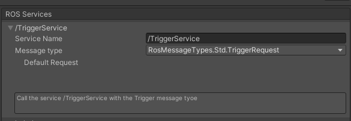
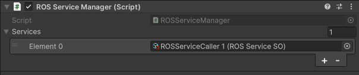
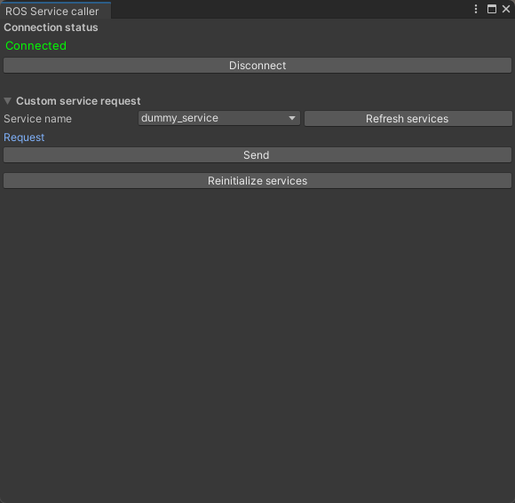

# (日本語)サービス管理

## サービスの登録
`Assets → Create → ScriptableObjects → ROS → Service Caller`を選択して、新しいROSServiceSO（スクリプタブルオブジェクト）を作成します。サービス名（ROSで呼び出すのと同じ名前にする必要があります！）と使用するメッセージタイプを入力して、サービスを追加できます。下のボックスにはサービスに関するコメントを入力できます。


メッセージタイプがサポートされている場合、ここでデフォルトのリクエストを設定することもできます。デフォルトのリクエストは、他のパラメータを指定せずにサービスを呼び出したときに使用されます。

メッセージタイプが表示されない場合は、`ROS Tools → Refresh enum types` を選択してタイプを更新してみてください。

スクリプタブルオブジェクトの準備ができたら、シーン内のGameObjectに`ROSServiceManager`のComponentを追加し、スクリプタブルオブジェクトを参照します。`ROSServiceManager`は、1つのシーンに1つしか存在しないことに注意してください。



## GUIでサービスを呼び出す
`ROS Tools → Service Caller`をクリックすると、`Service Caller`ウィンドウが開きます。

プレイモード以外でも、GUIを使用してROSに接続することができます。ただし、エディタの再生モードと停止モードを切り替える際に問題が発生する可能性がありますので、この機能は慎重に使用してください。



## スクリプトからサービスを呼び出す

スクリプトからサービスを呼び出すには、以下のコード例に従ってください：
```csharp
    void ExampleCall()
    {
        // Get a reference to the current Service Manager
        ROSServiceManager serviceManager = ROSServiceManager.GetOrCreateInstance();

        // Get the desired service and cast it with the proper Request/Response types
        var service = serviceManager.GetService("dummy_service") as ROSService<DummyRequest, DummyResponse>;
    
        // Create your request object
        var request = new DummyRequest();

        // Call the service
        service.Call(request, ExampleCallback);
    }
    
    
    void ExampleCallback(DummyResponse resp)
    {
        Debug.Log("Response from the dummy service");
    }
```